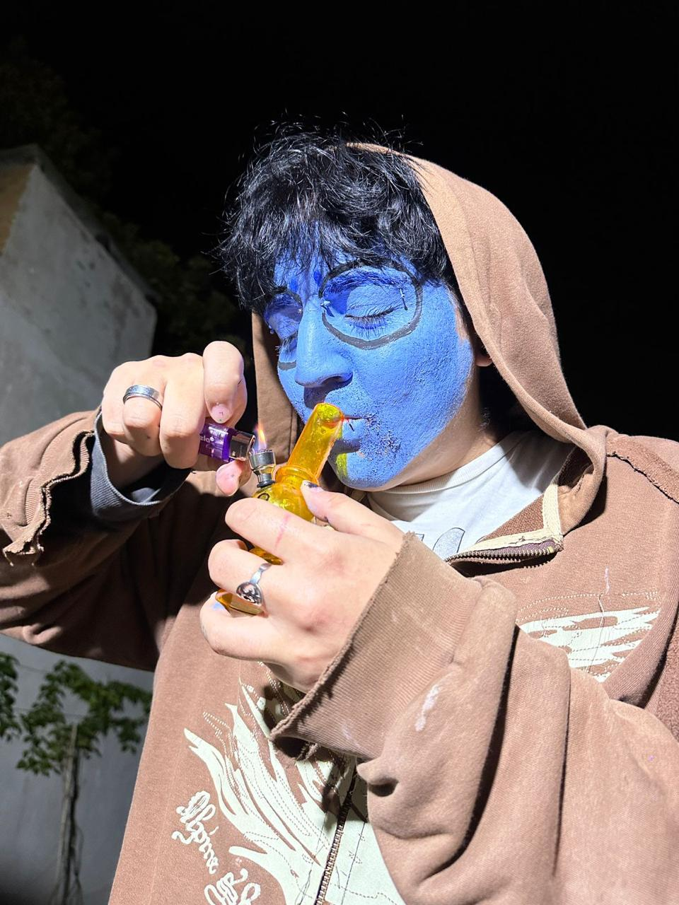
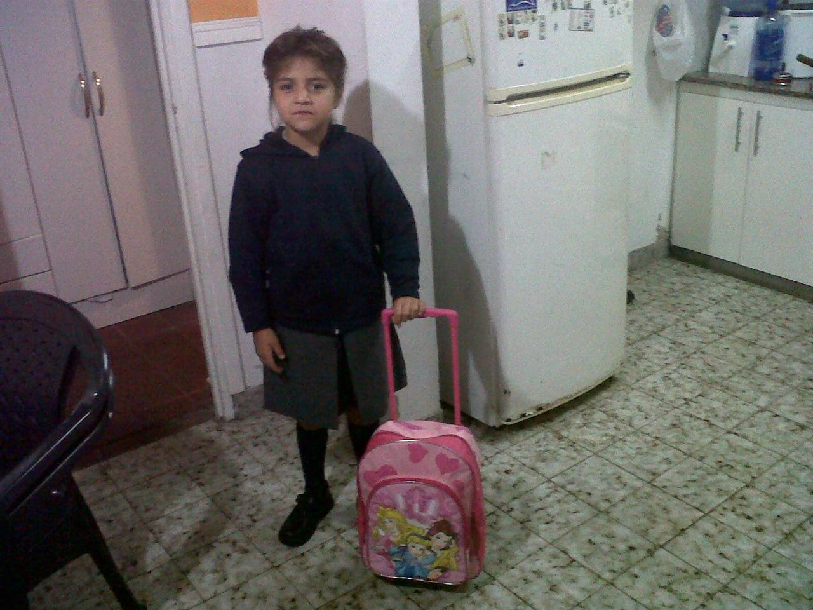
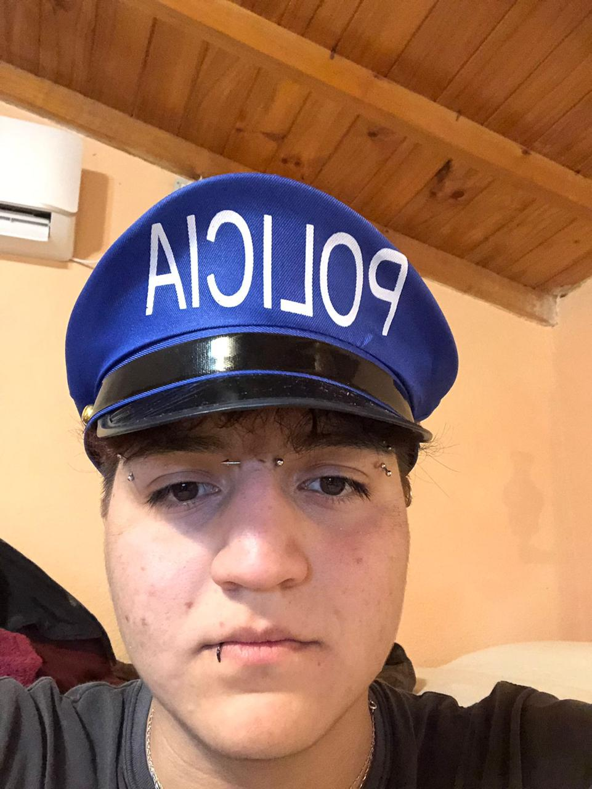
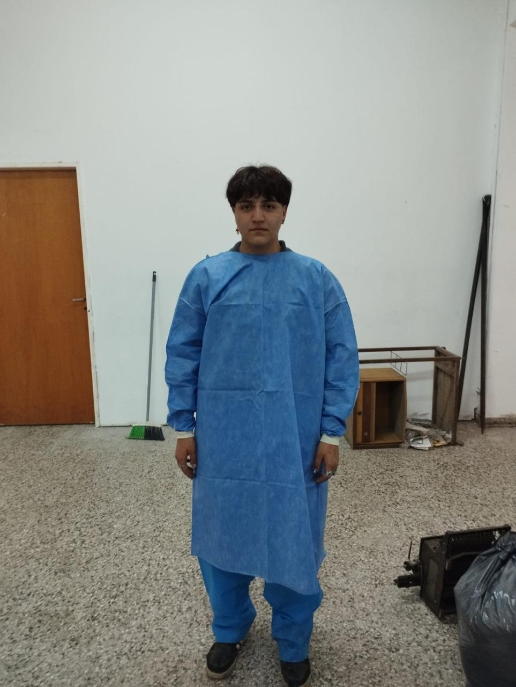
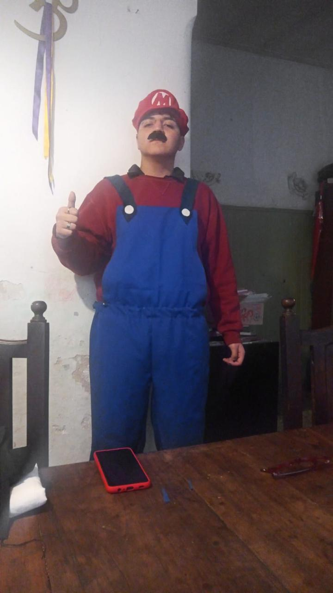
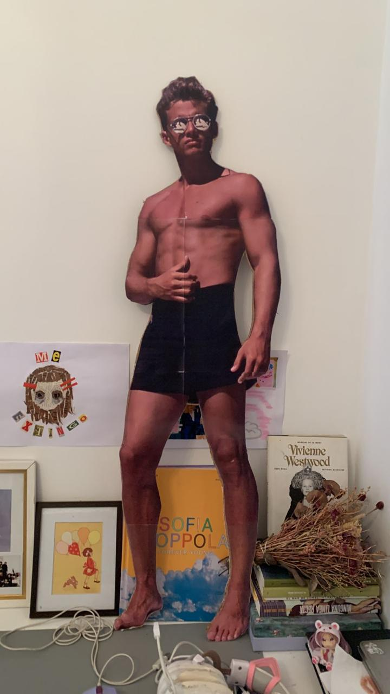
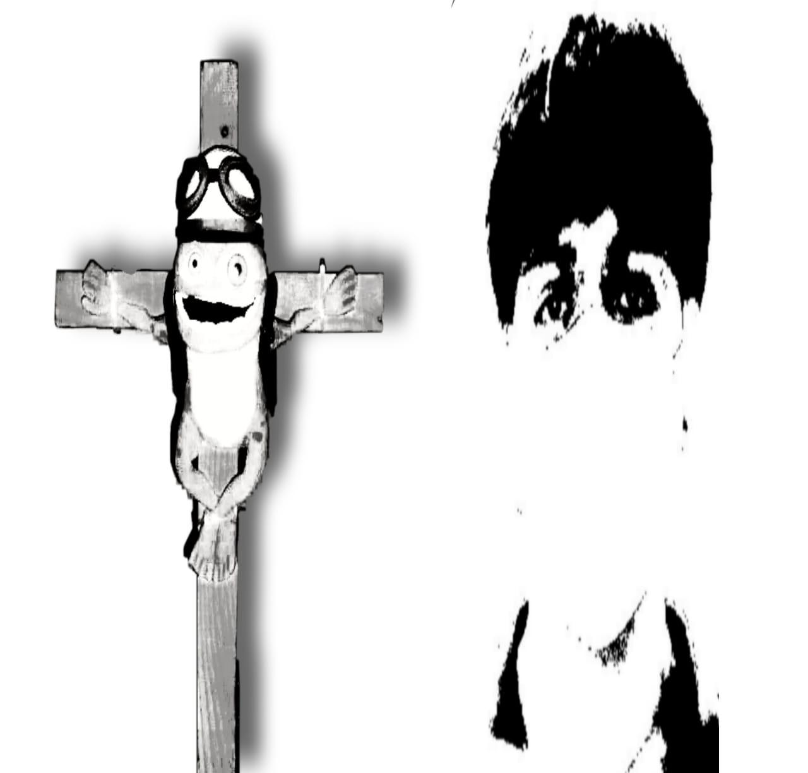
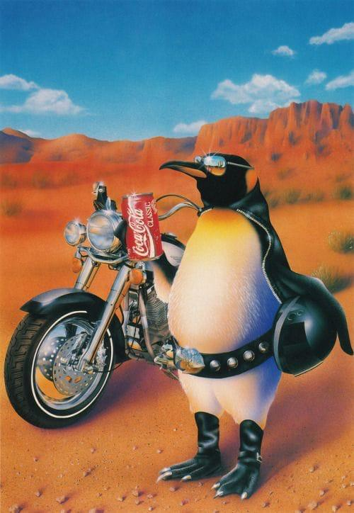
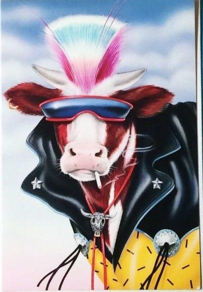

<!DOCTYPE html>
<html lang="es">
<head>
  <meta charset="UTF-8">
  <meta name="viewport" content="width=device-width, initial-scale=1.0">
  <title>Feliz cumpleeeeeee Uriel</title>
  
</head>
<body>

  <video id="bg-video" autoplay loop muted playsinline poster="" preload="auto">
    <source src="fuego.mp4" type="video/mp4">
    Tu navegador no soporta el video de fondo.
  </video>

  <h1>Feliz cumpleeeeeee Uriel 🎉🔥</h1>

  

    
    
    
    
    
    
    
    
    
    
    

      
Feliz cumpleeeeeeeee con amor de parte de <b>lautiveelese</b>

    

  

  <audio id="bg-music" loop autoplay>
    <source src="TU-CANCION.mp3" type="audio/mpeg">
  </audio>
  <audio id="carousel-audio">
    <source src="tema.mp3" type="audio/mpeg">
  </audio>

  
</body>
</html>
